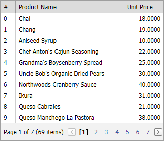

<!-- default badges list -->

[](https://supportcenter.devexpress.com/ticket/details/E1330)
[](https://docs.devexpress.com/GeneralInformation/403183)
[](#does-this-example-address-your-development-requirementsobjectives)
<!-- default badges end -->

# Grid View for ASP.NET Web Forms - How to add numbers to grid rows

This example demonstrates how to add row numbers (display row visible indices) in a grid.



## Implementation Details

1. Create an unbound column.

```aspx
<dxwgv:GridViewDataTextColumn Caption="#" UnboundType="String" />
```
2. Handle the [CustomColumnDisplayText](https://docs.devexpress.com/AspNet/DevExpress.Web.ASPxGridView.CustomColumnDisplayText) event to assign row visible indices to cell values in the unbound column.

```cs
protected void ASPxGridView1_CustomColumnDisplayText(object sender, DevExpress.Web.ASPxGridViewColumnDisplayTextEventArgs e) {
    if (e.Column.Caption == "#") {
        e.DisplayText = e.VisibleRowIndex.ToString();
    }
}
```

## Files to Review

* [Default.aspx](./CS/Default.aspx) (VB: [Default.aspx](./VB/Default.aspx))
* [Default.aspx.cs](./CS/Default.aspx.cs) (VB: [Default.aspx.vb](./VB/Default.aspx.vb))
<!-- feedback -->
## Does this example address your development requirements/objectives?

[](https://www.devexpress.com/support/examples/survey.xml?utm_source=github&utm_campaign=asp-net-web-forms-grid-add-numbers-to-rows&~~~was_helpful=yes) [](https://www.devexpress.com/support/examples/survey.xml?utm_source=github&utm_campaign=asp-net-web-forms-grid-add-numbers-to-rows&~~~was_helpful=no)

(you will be redirected to DevExpress.com to submit your response)
<!-- feedback end -->
